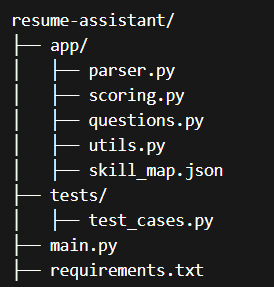
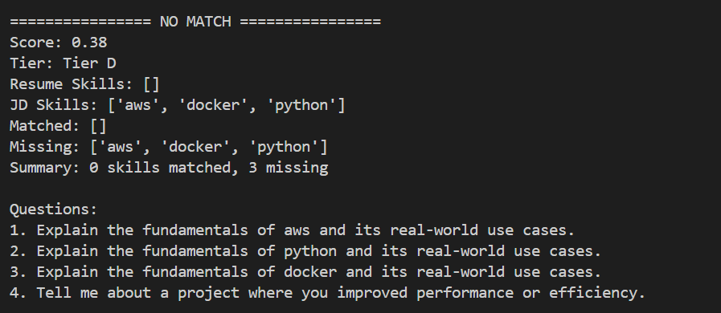
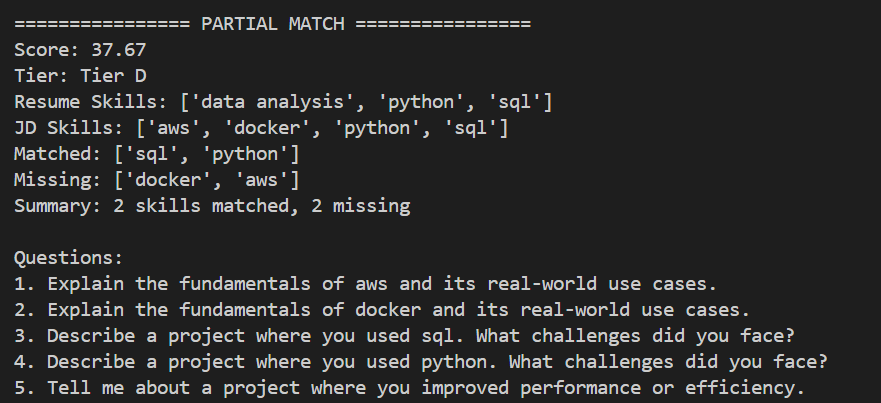
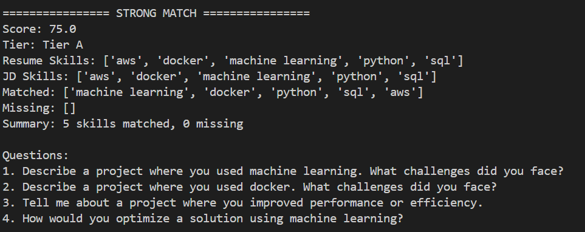
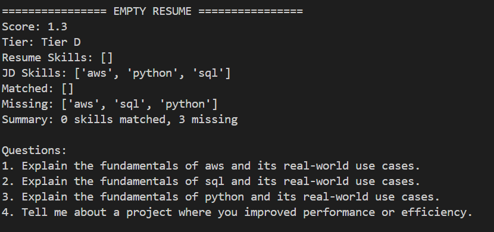
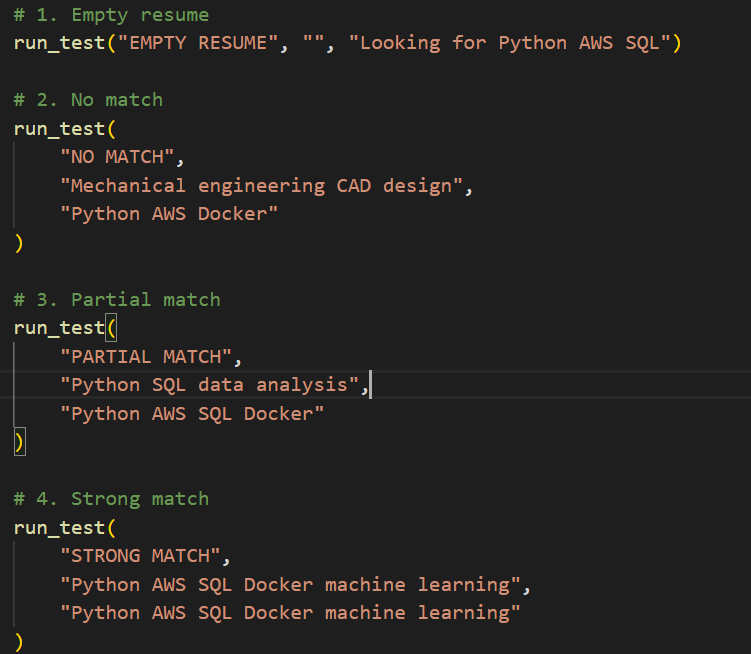

# AI Resume Shortlisting & Interview Assistant #

This project is a backend AI system that will check resumes based on a job description, give a score, and explain the rationale behind the score, categorize candidates by tier, and create personalized interview questions.  
The system doesn’t rely on keyword matching; rather, it uses different factors such as skill matching, semantic matching, achievements, and ownership to mimic how a recruiter would truly assess a candidate.

---

## SET-UP INSTRUCTIONS 

### BASH
```bash
git clone <repo>
cd resume-assistant
pip install -r requirements.txt
```

### Run API
```bash
uvicorn main:app --reload
```

### Run tests
```bash
python tests/test_cases.py
```

---

## PROJECT STRUCTURE 

## 🗂️ Project Structure



---

## 1. Project Overview

The system processes a **resume** (PDF or text) against a **job description** to generate the following outputs:

* **Final Score & Tier Classification:** A numerical ranking and categorical placement.  
* **Skill Analysis:** A detailed breakdown of both **matched** and **missing** skills.  
* **Contextual Insights:**
  * A **human-readable explanation** of the fit.  
  * **Tailored interview questions** specific to the candidate's background.  

---

## 2. System Architecture

### 🏗️ High-Level Flow

The system follows a linear pipeline designed to transform raw document data into actionable hiring intelligence:


### Key Design Principles

* Modular → each component is independent  
* Explainable → not just a score, but why  
* Extensible → easy to upgrade models or logic  
* Practical → built like a real hiring pipeline  

---

## 3. Implementation Details

### 3.1 Parser (parser.py)

Handles:
- PDF extraction using pdfplumber  
- Section detection using regex patterns  

**I/P**
```
Skills
Python, SQL

Experience
Worked on ML models
```

**O/P**
```python
{
  "skills": "...",
  "experience": "...",
  "other": "..."
}
```

---

### 3.2 Skill Extraction (utils.py)

Uses skill_map.json (custom-built)

Handles:
- synonyms (ML → machine learning)  
- variations (python3, py)  
- normalization  

**I/P**
```
Worked on ML models using Python
```

**O/P**
```
['machine learning', 'python']
```

---

### 3.3 Scoring Engine (scoring.py)

The system computes 4 independent scores:

1. **Exact Match Score (Weighted):**  
   Matches resume skills vs JD skills  
   Uses priority weights (important skills matter more)  

2. **Semantic Similarity:**  
   Uses SentenceTransformer (MiniLM)  
   Captures contextual similarity  

3. **Achievement Score:**  
   Detects words like:
   - improved  
   - optimized  
   - increased  

4. **Ownership Score:**  
   Detects:
   - built  
   - led  
   - designed  
   - implemented  

**Final Formula**
```
Final Score = (0.5 × Exact Match + 0.25 × Similarity + 0.15 × Achievement + 0.10 × Ownership)
```

---

### 3.4 Explainability

The system provides:
- matched skills  
- missing skills  
- critical gaps  
- interpretation (Strong / Moderate / Low)  

**Plus (Advanced)**  
- LLM-based explanation using Groq (LLaMA 3.1)  
- fallback if API key not available  

---

### 3.5 Question Generation (questions.py)

**Two modes:**

**Rule-Based**
- Missing skills → conceptual questions  
- Matched skills → project-based questions  
- Adds system design + impact questions  

**LLM-Based (Groq)**
- Generates dynamic, high-quality questions  
- Adjusts difficulty based on score  

---

### 3.6 API (main.py)

**FastAPI endpoint:**
```
POST /evaluate
```

**Returns**
```json
{
  "score": 75.0,
  "tier": "Tier A",
  "resume_skills": [...],
  "jd_skills": [...],
  "explanation": {...},
  "questions": [...]
}
```

---

### 3.7 Testing (test_cases.py)

Covers 10 real-world scenarios:

- empty resume  
- no match  
- partial match  
- strong match  
- achievement-heavy  
- random noise  
- synonym handling  
- soft + technical mix  
- overqualified candidate  
- irrelevant skills  

---

## Example Outputs

### 🔴 No Match Scenario


### 🟡 Partial Match Scenario


### 🟢 Strong Match Scenario


### ⚪ Empty Resume Scenario


### 🧪 Additional Test Cases


---

## 5. Tier Classification

| Tier | Meaning |
|------|--------|
| S | Exceptional |
| A | Fast-track |
| B | Technical screen |
| C | Needs evaluation |
| D | Weak match |

---

## 6. Assumptions & Trade-offs

### Assumptions
- Resumes can be messy/unstructured  
- Skills can come in different forms  
- Keywords alone are not sufficient  

### Trade-offs
- Rule-based parsing: fast but not very accurate  
- Embeddings: more accurate but at a cost  
- LLM: more accurate but requires API  

---

## 7. Limitations

- Scores can go slightly negative (edge case)  
- Better suited for tech resumes than creative resumes  
- API uses query params (schema not yet defined)  
- Depends on skill map coverage  
- LLM requires API key  

---

## 8. AI Tools Usage

### Where AI helped
- architecture brainstorming  
- initial code drafting  
- debugging (imports, execution issues)  
- structuring scoring logic  

---

### What I changed manually (Detailed Contributions)

Even though AI sped up progress on the project, it’s worth noting that a number of design choices were made to ensure that it’s more practical and recruiter-friendly.

1. **Expanded and Structured Skill Mapping**
- synonyms (ML → machine learning)  
- abbreviations (js → javascript)  
- real-world variations (pyspark, databricks, etc.)  
- both technical and soft skills  

This has greatly improved:
- recall (ability to identify more valid skills)  
- robustness (ability to deal with messy resumes)  

---

2. **Enhanced Skill Extraction Logic**
- text is normalized correctly  
- false positives are eliminated, especially for skills such as 'c', 'r'  
- direct matching and regex-based matching are combined  

---

3. **JD-Based Skill Weighting**
- high priority skills such as 'ML', 'AWS' have higher importance  
- medium and low priority skills have corresponding weight assignments  
- phrases such as 'must have', 'required' boost the weight  

---

4. **Enhanced Semantic Similarity**
- SentenceTransformer - 'all-MiniLM-L6-v2'  
- cosine similarity  

---

5. **Designed Multi-Dimensional Scoring**
- exact match - 50%  
- semantic similarity - 25%  
- achievement score - 15%  
- ownership score - 10%  

---

6. **Added Achievement & Ownership Signals**
- Achievement Score → detects impact words  
- Ownership Score → detects responsibility  

---

7. **Hybrid Explainability System**
- structured explanation  
- LLM-based explanation  
- fallback when API key is missing  

---

8. **Adaptive Interview Question Generator**
- missing skill-driven  
- matched skill-driven  
- soft skills  
- optional LLM enhancement  

---

9. **Extended Test Coverage**
- synonym match  
- soft skills and tech skills mix  
- overqualified candidates  
- irrelevant skills  
- noisy/random input  

---

10. **Debugging & System Stabilization**
- Python import path fixes  
- module execution issues  
- tests package  
- file structure  
- execution consistency  

---

## 9. Where I Disagreed with AI (Design Decisions & Rationale)

There were a few instances where I deliberately chose not to stick to the initial AI suggestions and instead decided to make changes for better realism and user experience.

1. **Moving Beyond Pure Keyword Matching**  
   Initial direction leaned toward basic exact match and simple similarity.  
   I redesigned this into weighted exact match, semantic similarity using embeddings, and multi-dimensional scoring.  
   This was done because real hiring decisions are not based purely on keyword overlap.

---

2. **Avoiding a Fully Black-Box Model**  
   Instead of using a fully ML-driven or opaque system, I structured the scoring into interpretable components such as exact match, similarity, achievement, and ownership.  
   This ensures that the system remains explainable and that recruiters can understand why a candidate received a certain score.

---

3. **Hybrid Instead of Fully LLM-Based System**  
   Instead of relying completely on LLMs, I kept rule-based logic as the core and used LLMs only as an enhancement layer (for explanation and question generation).  
   This ensures reliability, avoids full dependency on APIs, and keeps the system deterministic when needed.

---

4. **Making Question Generation Context-Aware**  
   Instead of generating generic interview questions, I designed the system to:
   - prioritize missing skills  
   - probe matched skills through project-based questions  
   - adjust difficulty based on candidate strength  

   This makes the questions more useful for actual evaluation rather than being generic.

---

5. **Adding Ownership & Achievement Signals**  
   These were not part of a basic scoring approach.  
   I added them to capture real-world impact and responsibility, since resumes are not just about listing skills but also about demonstrating contributions.

---

6. **Treating Skill Importance Unequally**  
   Instead of treating all skills equally, I introduced priority-based weighting (high, medium, low).  
   This reflects real hiring logic where missing a critical skill is more important than missing a minor one.

---

7. **Expanding Test Scenarios**  
   Instead of minimal testing, I added diverse and realistic edge cases such as:
   - synonym matching  
   - irrelevant resumes  
   - overqualified candidates  

   This ensures the system behaves well on real-world messy data.

---

8. **Keeping the System Practical Instead of Over-Engineering**  
   I avoided adding unnecessary complexity such as frontend layers or databases.  
   The focus was kept on building a strong and testable core pipeline within time constraints.
