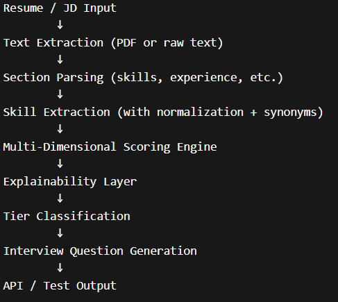

# AI Resume Shortlisting & Interview Assistant #

This project is a backend AI system that will check resumes based on a job description, give a score, and explain the rationale behind the score, categorize candidates by tier, and create personalized interview questions.
The system doesn’t rely on keyword matching; rather, it uses different factors such as skill matching, semantic matching, achievements, and ownership to mimic how a recruiter would truly assess a candidate.

## 1. Project Overview

The system processes a **resume** (PDF or text) against a **job description** to generate the following outputs:

* **Final Score & Tier Classification:** A numerical ranking and categorical placement.
* **Skill Analysis:** A detailed breakdown of both **matched** and **missing** skills.
* **Contextual Insights:**
    * A **human-readable explanation** of the fit.
    * **Tailored interview questions** specific to the candidate's background.

---

## 2. System Architecture

### 🏗️ **High-Level Flow**

The system follows a linear pipeline designed to transform raw document data into actionable hiring intelligence:

### Key Design Principles

* Modular → each component is independent
* Explainable → not just a score, but why
* Extensible → easy to upgrade models or logic
* Practical → built like a real hiring pipeline

## 3. Implementation Details
 ### 3.1 Parser (parser.py)

Handles:PDF extraction using pdfplumber
,Section detection using regex patterns : 

I/P: Skills
Python, SQL

Experience
Worked on ML models

O/P: {
  "skills": "...",
  "experience": "...",
  "other": "..."
}

### 3.2 Skill Extraction (utils.py)

Uses skill_map.json (custom-built)
Handles:
synonyms (ML → machine learning)
variations (python3, py)
normalization

I/P : Worked on ML models using Python

O/P : ['machine learning', 'python']

### 3.3 Scoring Engine (scoring.py)

The system computes 4 independent scores:

1. Exact Match Score (Weighted):Matches resume skills vs JD skills
Uses priority weights (important skills matter more)

2. Semantic Similarity:Uses SentenceTransformer (MiniLM)
Captures contextual similarity

3. Achievement Score:Detects words like:
improved, optimized, increased

4. Ownership Score: Detects:
built, led, designed, implemented

 Final Formula : Final Score = (0.5 × Exact Match +0.25 × Similarity +0.15 × Achievement +0.10 × Ownership)

### 3.4 Explainability

The system provides: matched skills , missing skills , critical gaps , interpretation (Strong / Moderate / Low)

Plus (Advanced)

LLM-based explanation using Groq (LLaMA 3.1) , fallback if API key not available

### 3.5 Question Generation (questions.py)

Two modes: Rule-Based

Missing skills → conceptual questions , Matched skills → project-based questions , Adds system design + impact questions

LLM-Based (Groq)

Generates dynamic, high-quality questions , Adjusts difficulty based on score

### 3.6 API (main.py)

FastAPI endpoint: POST /evaluate

Returns : {
  "score": 75.0,
  "tier": "Tier A",
  "resume_skills": [...],
  "jd_skills": [...],
  "explanation": {...},
  "questions": [...]
}

### 3.7 Testing (test_cases.py)

Covers 10 real-world scenarios:

*empty resume
*no match
*partial match
*strong match
**achievement-heavy
*random noise
*synonym handling
*soft + technical mix
*overqualified candidate
*irrelevant skills

## Example outputs : 

Strong Match : Score: 75.0
Tier: Tier A
Matched: ['python', 'aws', 'sql', 'docker', 'machine learning']
Missing: []

Partial Match : Score: 37.67
Tier: Tier D
Matched: ['python', 'sql']
Missing: ['aws', 'docker']

Synonym Match : Resume: ML
JD: Machine Learning
Score: 66.3
Tier: Tier B

